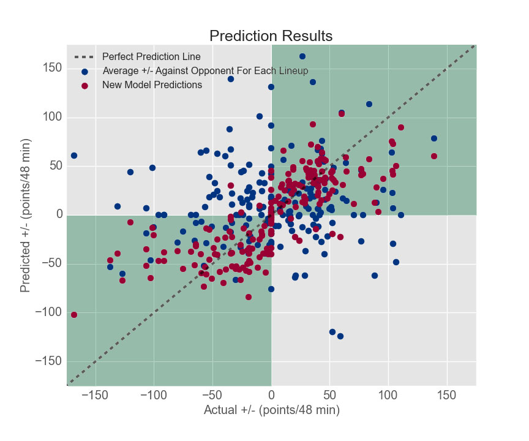
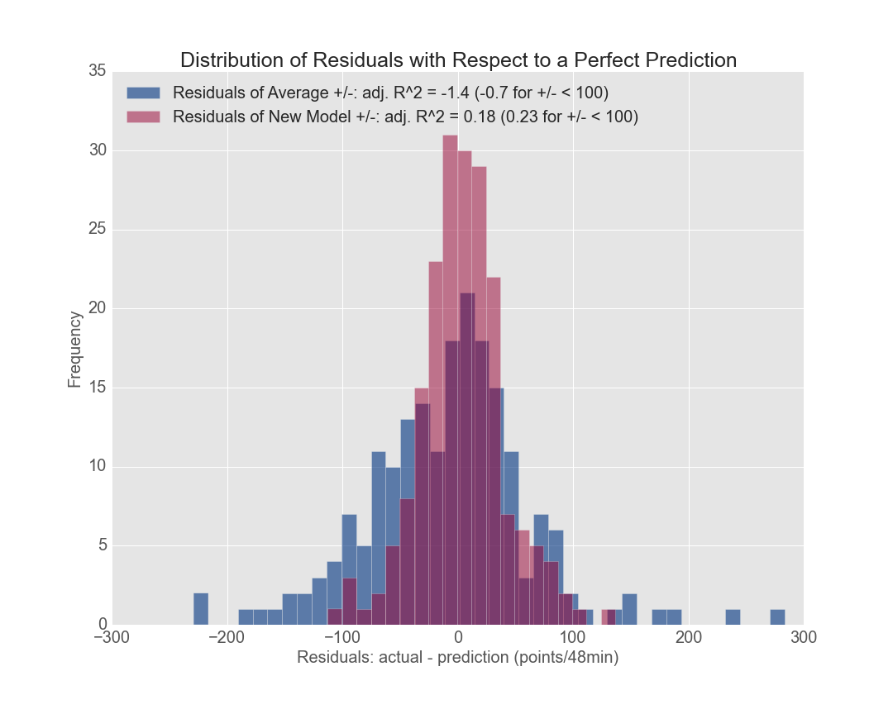

# NBA basketball Project

While watching the 2015 NBA Finals, I noticed that Steve Kerr, the coach of the Golden State Warriors, employed a strategy of changing the starting lineup, the combination of 5 players playing, used in a game in response to the unique challenge of playing the Cleveland Cavaliers. His potentially controversial decision to play Andre Iguodala, a 6' 6" player, and bench Andrew Bogut, a 7' 0" player that had made strong contributions to the team's success thus far, was one of the keys to winning the championship. 

Watching those games inspired me to develop a tool that can potentially help coaches make decisions on what lineups to employ against a particular opponent. During the course of a game, a coach frequently changes the lineup on the court, and these decisions can have a huge impact on the outcome. For a proof-of-concept, I gathered NBA data on the 2014-2015 regular season with the goal to learn from the first 4 months of the season and then to predict favorable lineups against specific opponents for the last two months of the season. The model I created correctly predicted whether a 5-man lineup is favored or not 87% of the time for lineups that have encountered an opponent previously. As a comparison, averaging the result of previous encounters gives an accurate prediction 62% of the time.

The metric I used to judge the performance of a lineup is the point differential, the number of points scored minus the number of points the opponent has scored. Since the amount of time a lineup plays is variable, I adjusted the metric to point differential per 48 minutes (pdpm). 48 minutes is the length of a standard basketball game, and adjusting the metric to per 48 minutes helped me with interpreting the number since teams are also judged by their point differential at the end of a game. I believe the magnitude of the point differential is an important consideration because it can provide insight on how much better a particular lineup can outscore their opponent.

# Tools and Data Set

To carry out this analysis, I mined and scraped data from http://www.basketball-reference.com and http://stats.nba.com using Python's BeautifulSoup, json, requests, and regular expressions packages. I stored this mined data in a SQLite database. Data analysis was performed using Python's pandas, numpy, and scipy packages in iPython notebooks.

My predictor is an ensemble of Lasso regression (L1 regularization), Stochastic Gradient Boosting regression, and Random Forest regression from Python's scikit-learn library. The data was also prepared using scikit-learn's k-means clustering algorithm to group various observations in order to generate new predictive features. The models were evaluated by a mean squared error, and each method was trained to a different set of features. Overall performance with respect to the mean squared error was optimized through ensembling the three models.

The original data set contained around 47000 observations, and I explored 200+ different features. Many observations contained lineups that played 0.0 minutes with empty entries. After discarding this data and examining lineups that have previously encountered an opponent, the data set contained between 1500-5000 observations depending on the cutoff for the amount of minutes a lineup has played.

# Evaluation metric 

The distribution of point differentials per 48 minutes (pdpm) after filtering out unreasonable entries is shown below:

The range of point differentials is large. Teams generally average single digit point differentials per game (roughly 48 minutes) over the course of a season. Only 8 teams have ever achieved a double digit point differential per game for a season, and the Golden State Warriors reached that milestone this year with a point differential of 10.1 (2nd place was 6.6 by the Clippers). This graph highlights how the pdpm can vary widely as coaches change lineups frequently.

The large point differentials are from lineups that play very few minutes. For example, I have seen a coach can make a substitution for a player and in the course of a minute, the team can make a 3 pointer, force a turnover, and make another 3 pointer before a coach makes another substitution. 6 points in 1 minute gives a point differential of 288 points per 48 minutes.

# Baseline

If available, coaches generally examine previous encounters with opponents when preparing for a game. With this in mind, a simple method to predict whether a lineup is favored is to average over the result of previous encounters. The results of this method can be shown on a plot of the predicted point differential vs. the actual point differential:

Any data point that lies on the black dotted line is a perfect prediction. A data point that lies within the shaded green region suggests that the prediction agrees with the actual result on whether a particular lineup is favored or not (true positive and true negative). Data points in the grey regions are predictions that incorrectly suggest whether a lineup is favored (false positive and false negative). This method correctly predicts a favored or unfavored matchup correctly 62% of the time with a false positive rate of 0.24 and a true positive rate of 0.37. Averaging based on past encounters can produce favorable results when compared to randomly picking lineups. 

This plot also shows how there is a very limited relationship between the prediction and the actual results. I obtained a r-squared value of -1.4, which implies that consistently predicting a constant value (the average predicted pdpm or 0) produces a better fit even though there would be less insight to make a coaching decision.

# Model Results

To build my model, I used data scraped from http://www.basketball-reference.com and aggregated it data from http://stats.nba.com on various lineups and statistics averaged over each month for every single team. In all, I started with over 100 different features. Furthermore, I used k-means clustering to group different features and compute various statistical aggregates such as mean and standard deviation. One example is that I clustered team data into 5 distinct groups based on their performance on the season thus far. 

In this graph, teams are clustered by their statistics such as their average point differential (PLUS_MINUS_opt), offensive rating (OFF_RATING_opt), and defensive rating (DEF_RATING_opt) in the season so far. The graph shows how teams were segmented into 5 groups. Group 5 has one extremely high performing team, the Warriors, which further suggests that the Warriors were in a class of their own last season. I used these groups to define similar opponents, and I calculated the average and the standard deviation of features such as point differential or field goal percentage over similar opponents for each lineup. In all, I performed k-means clustering on several features to help generate a dataset with over 200 features, and I used a different subset of features for each algorithm.

The final results of my prediction are shown below:

There are far fewer red data points, results of the new model, than blue data points in the grey region, indicating that this model correctly predicts whether a lineup is favorable or not at a better rate than averaging over previous encounters. This new model made a correct prediction 87% of the time with a false positive rate of 0.015 and a true positive rate of 0.51.

Lasso regression found that features such as the opposing team, effective Field goal percentage, 3 point percentage, free throw percentage, and point differential averaged over the first few months of the season are strong predictors. The decision tree-based models found that the point differential averaged across similar opponents, average number of minutes played across similar opponents, games played together, and average field goal differentials were heavily used predictors in building the model.

It is also helpful to examine the distributions of the residuals with respect to a perfect point differential prediction:

The distribution for the new model is considerably tighter (std: 36 pdpm) than the distribution for averaging over previous encounters (std: 73 pdpm), another indication that the new model outperforms the base model. I obtained adjusted R-squared values for the base model and the new model of -1.4 and 0.18, respectively. A significant portion of the variance in this result comes from the cases where a lineup goes on an unexpected scoring spree. If I focus my analysis on point differentials with magnitudes less than 100 pdpm (94% of the results), the adjusted R-squared values become -0.7 and 0.23 for the base model and the new model, respectively. Although the base model has an accuracy of 62%, it is a poor predictor of point differential with respect to R-squared. In this case, the magnitude of the base model's prediction cannot be trusted.

The magnitude of the point differential is an important consideration because it indicates by how much a lineup is favored. With this in mind, the new model can potentially identify highly favored lineups while the base model cannot.

# Examining the results of the model for making lineup decisions

Since I'm a fan of the Golden State Warriors, I focused my attention on Warriors lineups. One example where the model could help was when the Warriors played the San Antonio Spurs on April 5th, 2015 in San Antonio. In this game, the Spurs started the game explosively and jumped to a double digit point differential by the half-way point of the first quarter. In their previous encounters, the starting lineup of Harrison Barnes, Andrew Bogut, Steph Curry, Draymond Green, and Klay Thompson for the Warriors had an average point differential of 20.5 pdpm against the Spurs. However, this lineup of experienced a -48.8 pdpm by the end of the game and the Warriors never recovered from the early deficit.  My new model predicted that the lineup for the Warriors was going to lose by -34.1 pdpm, which suggests that Steve Kerr should consider a different lineup for this team. 

One lineup that I found that performed well during this game was Andrew Bogut, Steph Curry, Draymond Green, Andre Iguodala, and Klay Thompson. By swapping out Andre Iguodala for Harrison Barnes, the Warriors would achieve a point differential of 183 pdpm over the course of a little over 2 minutes. My prediction was that this new lineup for the Warriors were favored by 46.3 pdpm. During this brief period, the Warriors made 3/4 shots while the Spurs missed all of their shots, a rare occurance. The residuals of this prediction was one of my largest errors, but the model still correctly predicted a strongly favored matchup. I would suggest that this lineup merited strong consideration to play more than 2 minutes together.

Using this prediction as a starting point, one reason for using this lineup with Iguodala more against the Spurs is that San Antonio is famed for their strong perimeter defenders, Kawhi Leonard (Defense Player of the Year) and Danny Green, and Iguodala is capable of initiating offense as a ball-handler. In fact, Kawhi Leonard stole the ball 3 times before the half way point of the first quarter resulting in 4 quick points for the Spurs, and he made it extremely difficult for the Warriors to initiate their offense through Steph Curry. Replacing Harrison Barnes with Andre Iguodala in this situation will add additional ball-handling on the court to keep the ball away from Kawhi Leonard and Danny Green. Although Steve Kerr made the famous decision to bring Andre Iguodala off the bench for the season, this is a good situation to consider Iguodala in the starting lineup or at least in lineups when Kawhi Leonard is guarding Steph Curry.
